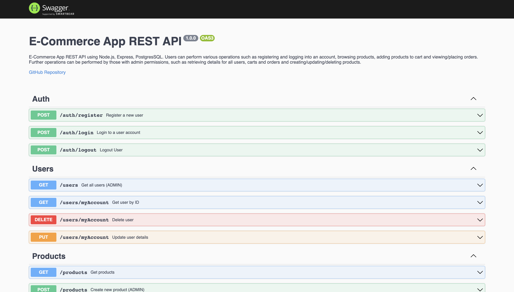

# E-Commerce App REST API using Node.js, Express and PostgresSQL

This project involved building a fully functioning e-commerce application REST API. Users can perform various operations such as registering and logging into an account, browsing products, adding products to cart and viewing/placing orders.

This project is part of Codecademy's Full-Stack Engineer career path.

## Running the app

To run the app locally, run `npm install`, then `npm run start` in the project directory.

This project requires you have a [PostgreSQL](https://www.postgresql.org/) database to run locally. Reference the ERD (Entity Relationship Diagram) in the `resources` folder to view the structure of the tables. You can use [pgAdmin](https://www.pgadmin.org/) or [Postbird](https://github.com/Paxa/postbird) to interact with the database manually. 

After installation, you will need to add your environment variables in a `.env` file. This repo includes an `example.env` file that contains all the environment variables for reference. Make sure to replace the example values with those specific to your environment. 

To easily populate your database with the requisite tables, `npm run create-db`.  This will create tables in your database if they do not already exist.  The configuration for this script can be found in the  `setupDatabase.js` file located in the `db` folder. 

**Note** Running `npm run create-db` will only create the tables and not the database itself. Once you have downloaded the Postgres GUI client of your choice, you will need to manually create a database first before running the `npm run create-db` command.

### Environment Variables
Here is a list of the environment variables and their function:

- `PGUSER` : User's Postgres username
- `PGHOST` : Database hostname
- `PGPASSWORD` : User's Postgres password
- `PGDATABASE` : Name of the database
- `PGPORT` : Postgres port number
- `SESSION_SECRET`: Session secret
- `PORT` : Local port number

## Testing
Swagger documentation available at `http://localhost:<your-port>/docs`

You can use various HTTP clients such as [Postman](https://www.postman.com/) or [Insomnia](https://insomnia.rest/) to make requests to the API endpoints.

**Note:** Most endpoints are protected and require authentication.  In order to properly access these endpoints, you will need to have a session cookie present when making your request.  This is accessed by hitting the `/auth/login` endpoint first.  HTTP clients will automatically store cookies and send them with subsequent requests.

## Features

- Register an account
- Browse products 
- Add products to cart
- Checkout cart
- View order history

## Technologies

- Node.js (v16.18.0)
- Express (v4.18.2)
- PostgreSQL (v15.2)

## Screenshot

## Acknowledgements
- [Brandon Hazelton](https://github.com/hazeltonbw)

## To-Do:
- [ ] Testing

